# **Conceptos**

## **Arquitectura de computadoras**

- **Placa madre:** es una estructura plana de fibra de vidrio que soporta la arquitectura que constituye a un ordenador. También es conocida como tarjeta madre o placa base.

    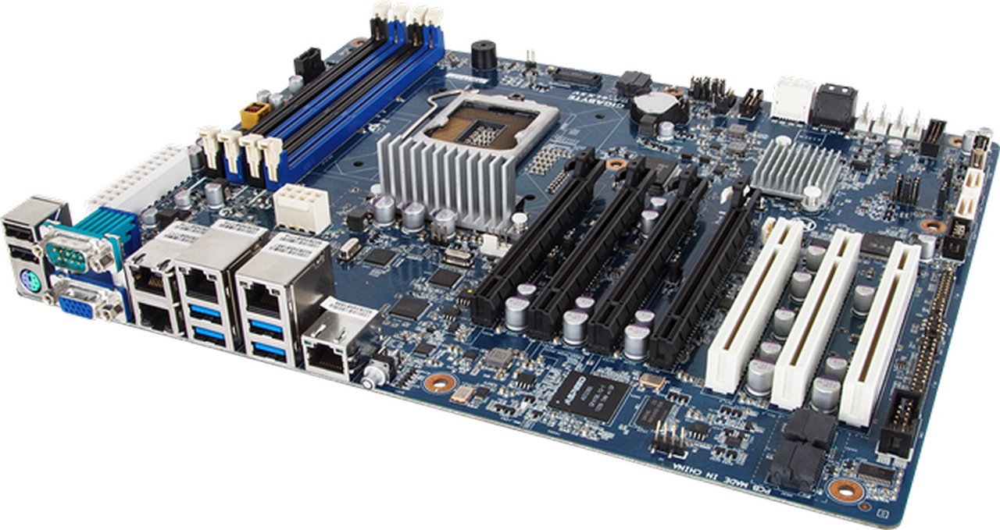

- **ChipSets:** es un juego de circuitos integrados diseñados para servir de interfaz entre el procesador y los demás elementos del sistema.

    - **NorthBridge:** es la parte principal del chipset y controla el tráfico de datos entre el procesador, la memoria RAM, la interfaz de video y el SouthBridge.

    - **SouthBridge:** es el encargado de controlar dispositivos como el bus PCI, los puertos USB y FireWire, SATA y Parallel ATA.

        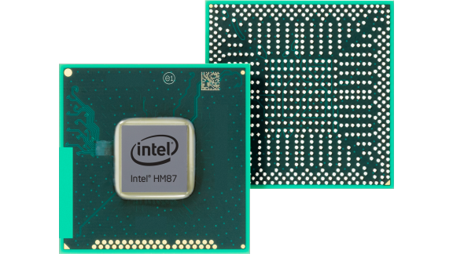

- **CPU:** la unidad central de procesamiento es la encargada de interpretar las instrucciones de un programa y los requisitos del sistema operativo, así como las órdenes de los componentes y las aplicaciones.

    

- **GPU:** la unidad de procesamiento gráfico representa el corazón de la tarjeta gráfica, se encarga de realizar todos los cálculos complejos que nos permiten visualizar información en la pantalla.

    

- **Memoria RAM:** es un tipo de memoria volátil que actúa como puente entre el sistema operativo, software, procesador y otros dispositivos para que estos compartan información entre ellos.

    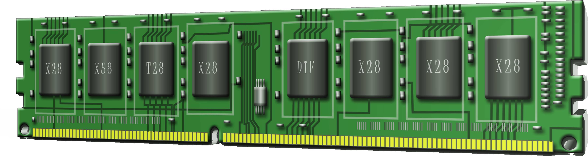

- **Memoria ROM:** a diferencia de la memoria RAM, esta no es volátil, es decir, la información será retenida aunque el ordenador se apague.

    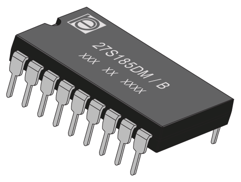

- **Slots de expansión:** se trata de conectores diseñados para conectar tarjetas que permitan ampliar las características de la placa base.
         
    

    - **Bus ISA:** establece la conexión entre el procesador y las tarjetas de expansión.

    - **Bus PCI:** conectan dispositivos periféricos directamente con la tarjeta madre.

    - **Bus AGP:** conecta el adaptador de gráficos con la memoria.

    - **Bus USB:** recibe y transmite datos con los dispositivos conectados a este.

    - **Bus FireWire:** muy parecido al USB, aunque se usa especialmente para conecectar cámaras, impresoras, etc.

    - **Bus PCMCIA:** actualmente suelen usarse para conectar el disco duro, la tarjeta de red, etc.

    - **Bus MR/AMR:** se trata de una ranura de expansión en la placa base para dispositivos de audio.

 
## **Sistemas operativos**

- **Sistema operativo:** es el software que coordina y dirige todos los servicios y aplicaciones que se utilizan en una computadora. Se divide en los siguientes niveles:

    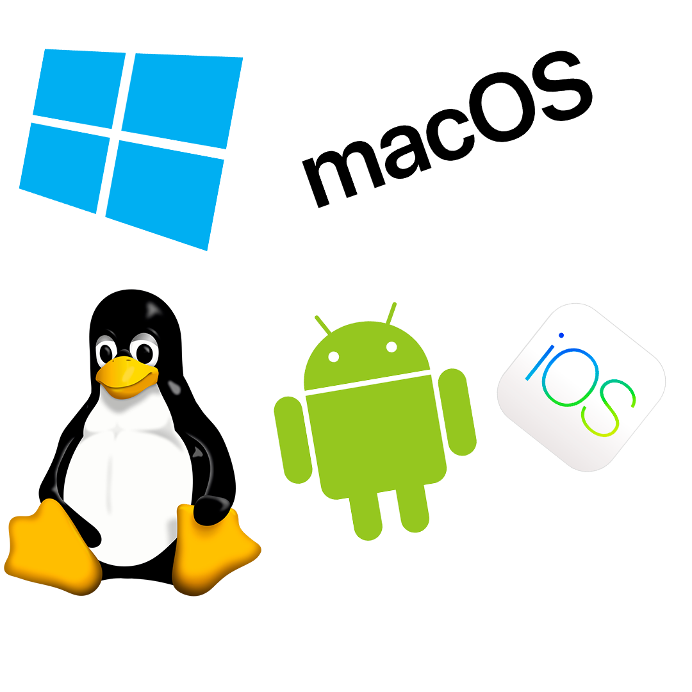

    1. **Kernel:** es el núcleo del sistema operativo, se encarga de administrar y sincronizar los procesos del mismo.

    2. **Gestión E/S:** son los controladores necesarios para poder administrar dispositivos externos. Estos reciben o envían información a dichos dispositivos.

    3. **Gestión de memoria:** es la administración de ambas, la memoria física y la memoria virtual.

    4. **Sistemas de archivos:** el sistema operativo también administra los archivos a través de directorios.

    5. **Interfaz de usuario:** esta es por la cual el sistema operativo se comunica directamente con el usuario.

## **Redes**

- **Red de computadoras:** es la interconexión de un número de sistemas informáticos a través de dispositivos de telecomunicaciones y un medio físico, ya sea alámbrico o inalámbrico. En la actualidad destacan dos modelos: OSI y TCP/IP. 

    - ***Modelo OSI:*** 

        1. **Physical:** se refiere al hardware y define el medio de comunicación (tipo de cable y conectores), los niveles eléctricos de la señal y la velocidad de transmisión.

        2. **Data link:** es la conexión física entre máquinas. En este nivel debe asegurarse la transmisión y recepción sin errores. Solo tiene la capacidad de encaminar paquetes entre nodos de la misma red, esto debido al bridge.

        3. **Network:** este nivel se encarga de llevar los paquetes a su destino, esta vez pudiendo hacerlo entre redes interconectadas mediante router con protocolos de transmisión definidos.

        4. **Transport:** realiza una conexión de extremo a extremo entre los niveles de transporte de las máquinas de origen y destino, subsanando las posibles deficiencias del nivel de red.

        5. **Session:** controla el diálogo entre los usuarios de diferentes máquinas y realiza tareas de sincronización para evitar que ambos extremos realicen una misma operación a la vez, de modo que el tráfico de datos vaya en un solo sentido.

        6. **Presentation:** se ocupa de la representación, compresión y encriptación de la información, es decir, de su codificación.

        7. **Application:** esta última se ocupa de la emulación de terminales, transferencia de ficheros, correo electrónico y más aplicaciones.

            

    - ***Modelo TCP/IP:***

        1. **Network:** posibilita el acceso físico a la red y especifíca el tipo de datos que deben enrutarse. Concuerda con los primeros dos niveles del modelo OSI.

        2. **Internet:** es el nivel equivalente al nivel de Red de OSI, proporcionando el paquete de datos y las direcciones IP. Además, engloba protocolos como IP, ARP, ICMP, IGMP, etc.

        3. **Transport:** este nivel permite conocer el estado de transmisión, así como los datos de enrutamiento. También asocia los tipos de aplicación con los tipos de dato, y es el equivalente al cuarto nivel en OSI.

        4. **Application:** este nivel encapsula los niveles 5, 6 y 7 del modelo OSI, suministrando aplicaciones de red que se comunican con las capas anteriores. 

            

## **Nube**

- **Azure:** es una plataforma de computación en la nube creado por Microsoft, que permite compilar, implementar y administrar aplicaciones en una red global de centros de datos.

- **Computo en la nube:** es un conjunto de servidores remotos alojados en internet. Sirve para almacenar, gestionar y procesar datos.

    - ***Tipos de nube:***

        - **Nube privada:** son los servicios de computación en la nube que solo se ofrecen a algunos usuarios, como empresas u organizaciones.

        - **Nube pública:** en este caso, toda la infrestructura es propiedad del proveedor, quien los ofrece al público en general. Un ejemplo de nube pública puede ser Microsoft Azure.

        - **Nube híbrida:** este tipo de nube combina la infraestructura de una nube pública con la de una nube privada, permitiendo que los datos viajen entre ambas.

            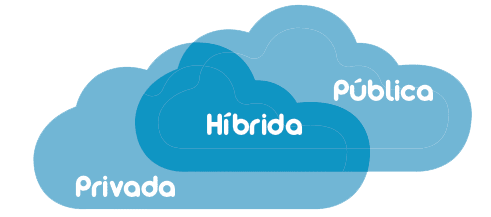

    - ***Modelos de servicio:***

        - **IaaS:** (infraestructura como servicio) en este tipo de servicio es el cliente quien se encarga de la gestión de la infraestructura. El proveedor dará acceso a las características deredes, a las máquinas virtuales y al espacio de almacenamiento.
    
        - **PaaS:** (plataforma como servicio) en este caso, el entorno de desarrollo ya será proporcionado por el proveedor, listo para escribir código de alta calidad y ponerlo en marcha.
    
        - **SaaS:** en el caso de software como servicio, las aplicaciones ya se encuentran en la nube del proveedor, y la conexión se realizará por medio de la web o una API.

            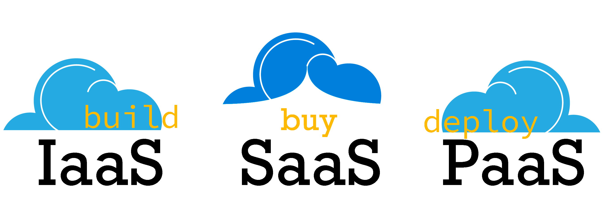

- **Frontend:** es la parte de una aplicación con la que interactúan los usuarios, es decir, todo lo que se muestra en pantalla.

- **Backend:** por otro lado, el backend es todo lo que hay detrás de estas aplicaciones, lo que hace que todos los procesos de esta funcionen de manera correcta.

    

- **API:** la interfaz de programación de aplicaciones es un conjunto de funciones y procedimientos que se utiliza como capa de abstracción dentro de un software para comunicarse con otro, ya sea una base de datos, un sistema operativo, etc.

    

- **Inteligencia Artificial:** es la capacidad que tienen algunos sistemas o máquinas para imitar la inteligencia humana, pudiendo realizar tareas y mejorar la forma en que lo hacen de forma iterativa gracias a la información que recopilan.

- **DataOps:** es una forma de administrar datos, promoviendo la comunicación entre desarrolladores, ingenieros, cientificos, analistas y usuarios para ayudar a que las empresas tomen decisiones basadas en los datos correctos.

    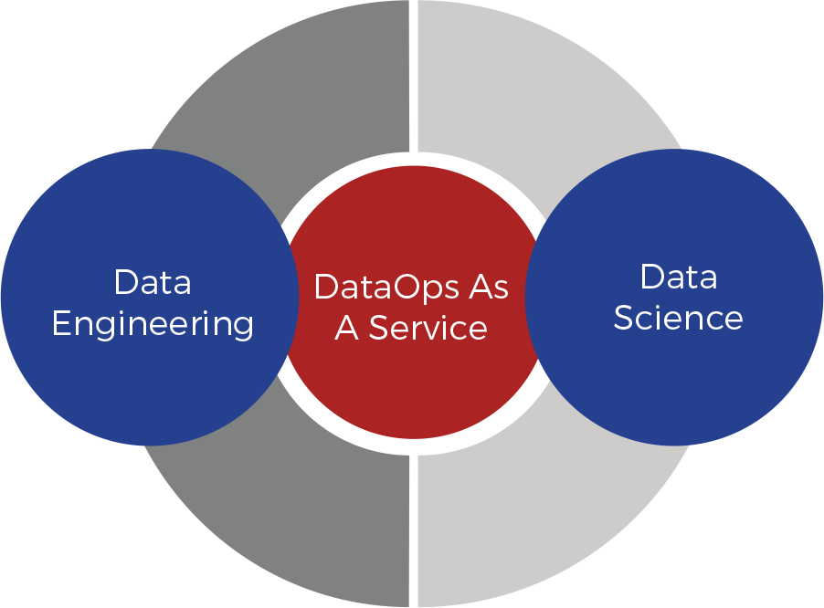

- **DevOps:** se trata de una metodología para creación de software. Se basa en la integración entre desarrolladores y administradores, permitiendo que la fabricación del mismo sea más rápida y de mayor calidad.

    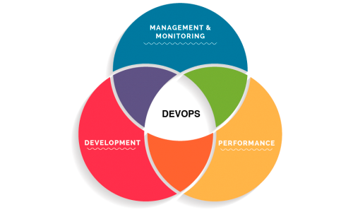

- **ModelOps:** está enfocada principalmente en la gestión de la gobernanza y el ciclo de vida de los modelos de inteligencia artificial, por ejemplo, machine learning, reglas, optimización, etc.

    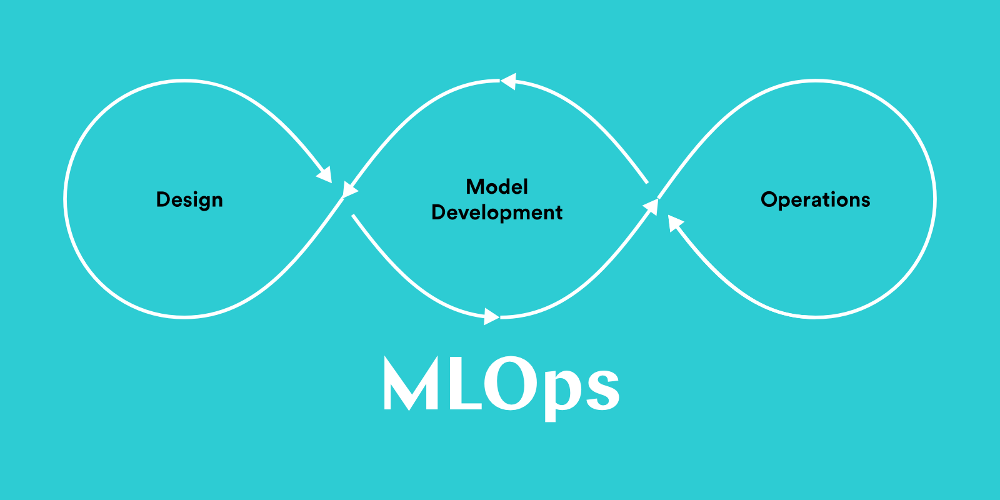

- ***Infraestructura global:***

    - **Regiones:** son conjuntos de centros de datos que se encuentran dentro de un perímetro determinado en el planeta.

    - **Geografía:** se trata de una zona o mercado donde se encuentran dos o más regiones, respetando los límites de residencia de datos y el cumplimiento normativo.

        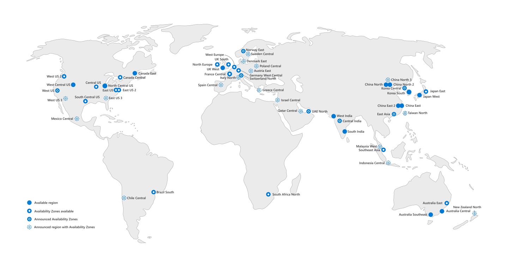

- **Elasticidad:** cuando los recursos se amoldan a las demandas cambiantes de una empresa.

- **Escalabilidad:** es la capacidad que tiene el sistema de crecer, adaptando su rendimiento al número (en aumento) de usuarios, transacciones, etc. 

    - **Horizontal:** se obtiene aumentando el número de servidores que atenderán las peticiones de manera conjunta (cluster), distribuyendo la carga de trabajo entre todos.

    - **Vertical:** es el crecimiento del hardware del servidor, por tanto, se obtiene aumentando los recursos del mismo y se centra en la capacidad de procesamiento y almacenamiento.

        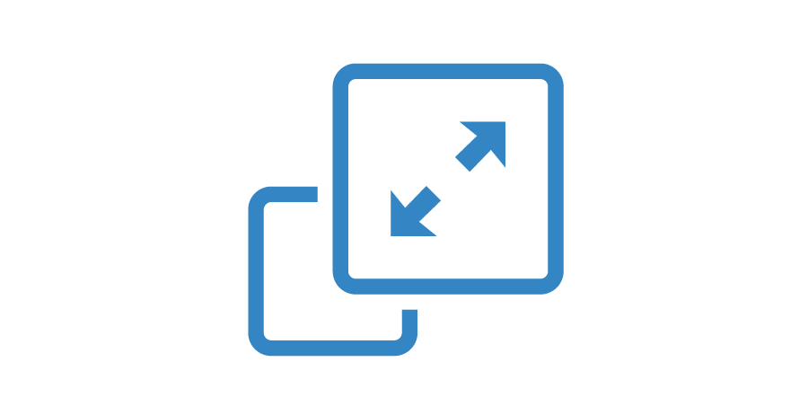

- **CapEx:** el capital expenditure o gasto en capital es la inversión que realiza una empresa para adquirir, mantener o mejorar su activo fijo, como switches, teléfonos o servidores. En este pagas por adelantado, estimando la vida útil de tu equipo, como cuando adquieres una nueba computadora personal con determinada cantidad de memoria. 

    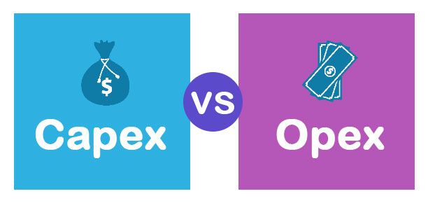

- **OpEx:** los operational expenditures o gastos operacionales son el capital utilizado para mantener o mejorar activos circulantes de la empresa, como el software, aplicaciones en la nube o hardware alquilado. En este pagas por lo que usas, como cuando solicitas mayor espacio de almacenamiento en la nube.