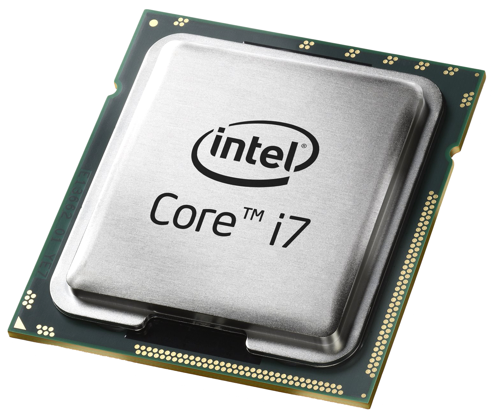

# **Conceptos**

## **Arquitectura de computadoras**

- **Placa madre:** es una estructura plana de fibra de vidrio que soporta la arquitectura que constituye a un ordenador. También es conocida como tarjeta madre o placa base.

    

- **ChipSets:**

    

- **Memoria RAM:**

    

- **Memoria ROM:**

    

- **Procesador:**

    

- **Slots de expansión:** se trata de conectores diseñados para conectar tarjetas que permitan ampliar las características de la placa base.
         
    

    - **Bus ISA:** establece la conexión entre el procesador y las tarjetas de expansión.

    - **Bus PCI:** conectan dispositivos periféricos directamente con la tarjeta madre.

    - **Bus AGP:** conecta el adaptador de gráficos con la memoria.

    - **Bus USB:** recibe y transmite datos con los dispositivos conectados a este.

    - **Bus FireWire:** muy parecido al USB, aunque se usa especialmente para conecectar cámaras, impresoras, etc.

    - **Bus PCMCIA:** actualmente suelen usarse para conectar el disco duro, la tarjeta de red, etc.

    - **Bus MR/AMR:** se trata de una ranura de expansión en la placa base para dispositivos de audio.
 
## **Sistemas operativos**

- **API:**

- **Backend:**

- **CapEx:**

## **La nube**
    
- **Azure:**

- **Computo en la nube:**

    - ***Tipos de nube:***

        - **Nube híbrida:**

        - **Nube privada:**

        - **Nube pública:**

    - ***Modelos de servicio:***

        - **IaaS:**
    
        - **PaaS:**
    
        - **SaaS:**

- **CPU:**

- **DevOps:**

- **Escalabilidad:**

    - **Horizontal:**

    - **Vertical:**

- **Frontend:**

- **GPU:**

- **Inteligencia Artificial:**

- **Kernel:**

- **OpEx:**

- **Sistema operativo:**
