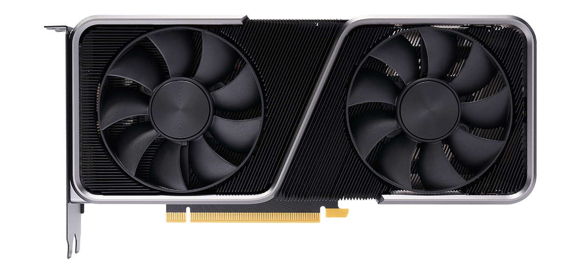

# **Conceptos**

## **Arquitectura de computadoras**

- **Placa madre:** es una estructura plana de fibra de vidrio que soporta la arquitectura que constituye a un ordenador. También es conocida como tarjeta madre o placa base.

    

- **ChipSets:** es un juego de circuitos integrados diseñados para servir de interfaz entre el procesador y los demás elementos del sistema.

    - **NorthBridge:** es la parte principal del chipset y controla el tráfico de datos entre el procesador, la memoria RAM, la interfaz de video y el SouthBridge.

    - **SouthBridge:** es el encargado de controlar dispositivos como el bus PCI, los puertos USB y FireWire, SATA y Parallel ATA.

        

- **CPU:** la unidad central de procesamiento es la encargada de interpretar las instrucciones de un programa y los requisitos del sistema operativo, así como las órdenes de los componentes y las aplicaciones.

    

- **GPU:** la unidad de procesamiento gráfico representa el corazón de la tarjeta gráfica, se encarga de realizar todos los cálculos complejos que nos permiten visualizar información en la pantalla.

    

- **Memoria RAM:** es un tipo de memoria volátil que actúa como puente entre el sistema operativo, software, procesador y otros dispositivos para que estos compartan información entre ellos.

    

- **Memoria ROM:** a diferencia de la memoria RAM, esta no es volátil, es decir, la información será retenida aunque el ordenador se apague.

    

- **Slots de expansión:** se trata de conectores diseñados para conectar tarjetas que permitan ampliar las características de la placa base.
         
    

    - **Bus ISA:** establece la conexión entre el procesador y las tarjetas de expansión.

    - **Bus PCI:** conectan dispositivos periféricos directamente con la tarjeta madre.

    - **Bus AGP:** conecta el adaptador de gráficos con la memoria.

    - **Bus USB:** recibe y transmite datos con los dispositivos conectados a este.

    - **Bus FireWire:** muy parecido al USB, aunque se usa especialmente para conecectar cámaras, impresoras, etc.

    - **Bus PCMCIA:** actualmente suelen usarse para conectar el disco duro, la tarjeta de red, etc.

    - **Bus MR/AMR:** se trata de una ranura de expansión en la placa base para dispositivos de audio.

 
## **Sistemas operativos**

- **Sistema operativo:** es el software que coordina y dirige todos los servicios y aplicaciones que se utilizan en una computadora. Se divide en los siguientes niveles:

    

    1. **Kernel:** es el núcleo del sistema operativo, se encarga de administrar y sincronizar los procesos del mismo.

    2. **Gestión E/S:** son los controladores necesarios para poder administrar dispositivos externos. Estos reciben o envían información a dichos dispositivos.

    3. **Gestión de memoria:** es la administración de ambas, la memoria física y la memoria virtual.

    4. **Sistemas de archivos:** el sistema operativo también administra los archivos a través de directorios.

    5. **Interfaz de usuario:** esta es por la cual el sistema operativo se comunica directamente con el usuario.

## **La nube**
    
- **Azure:**

- **Computo en la nube:**

    - ***Tipos de nube:***

        - **Nube híbrida:**

        - **Nube privada:**

        - **Nube pública:**

    - ***Modelos de servicio:***

        - **IaaS:**
    
        - **PaaS:**
    
        - **SaaS:**

- **DevOps:**

- **Escalabilidad:**

    - **Horizontal:**

    - **Vertical:**

- **Frontend:**

- **Inteligencia Artificial:**

- **OpEx:**

- **API:**

- **Backend:**

- **CapEx:**